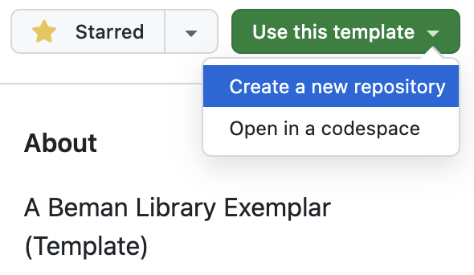

# How to Use This Template

To create a new Beman library, first click the "Use this template" dropdown in the
top-right and select "Create a new repository":

<table><tr><td>
    
</td></tr></table>

This will create a new repository that's an exact copy of exemplar. The next step is to
customize it for your use case.

This repository now uses Copier as its templating engine. The template inputs are defined
in `copier.yml`, the rendered project files live under `template/`, and
`./copier/check_copier.sh` verifies that the repository still round-trips through Copier
correctly.

To do so, execute the bash script `stamp.sh`. This script will prompt for parameters like
the new library's name, paper number, and description. Then it will replace your exemplar
copy with a stamped-out template containing these parameters and create a corresponding
git commit and branch:

```shell
$ ./stamp.sh
  [1/6] project_name (my_project_name): example_library
  [2/6] maintainer (your_github_username): your_username
  [3/6] minimum_cpp_build_version (20):
  [4/6] paper (PnnnnRr): P9999R9
  [5/6] description (Short project description.):
    unit_test_library? Format: str
    Choices:
        - gtest
        - catch2
    > gtest
Switched to a new branch 'stamp'
Successfully stamped out exemplar template to the new branch 'stamp'.
Try 'git push origin stamp' to push the branch upstream,
then create a pull request.
```

`stamp.sh` is a convenience wrapper around `copier copy`. It creates an isolated virtual
environment, renders from a temporary snapshot of the repository, runs `pre-commit`, and
commits the stamped result onto a `stamp` branch.

From there, you can simply fill in all the remaining parts of the repository that are
labeled 'todo'.

What follow is an example of a Beman library README.

<!-- markdownlint-disable-next-line MD025 -->
# beman.exemplar: A Beman Library Exemplar

<!--
SPDX-License-Identifier: Apache-2.0 WITH LLVM-exception
-->

<!-- markdownlint-disable-next-line line-length -->
   [](https://coveralls.io/github/bemanproject/exemplar?branch=main)  [](https://godbolt.org/z/4qEPK87va)

`beman.exemplar` is a minimal C++ library conforming to [The Beman Standard](https://github.com/bemanproject/beman/blob/main/docs/beman_standard.md).
This can be used as a template for those intending to write Beman libraries.
It may also find use as a minimal and modern  C++ project structure.

**Implements**: `std::identity` proposed in [Standard Library Concepts (P0898R3)](https://wg21.link/P0898R3).

**Status**: [Under development and not yet ready for production use.](https://github.com/bemanproject/beman/blob/main/docs/beman_library_maturity_model.md#under-development-and-not-yet-ready-for-production-use)

## License

`beman.exemplar` is licensed under the Apache License v2.0 with LLVM Exceptions.

## Usage

`std::identity` is a function object type whose `operator()` returns its argument unchanged.
`std::identity` serves as the default projection in constrained algorithms.
Its direct usage is usually not needed.

### Usage: default projection in constrained algorithms

The following code snippet illustrates how we can achieve a default projection using `beman::exemplar::identity`:

```cpp
#include <beman/exemplar/exemplar.hpp>

namespace exe = beman::exemplar;

// Class with a pair of values.
struct Pair
{
    int n;
    std::string s;

    // Output the pair in the form {n, s}.
    // Used by the range-printer if no custom projection is provided (default: identity projection).
    friend std::ostream &operator<<(std::ostream &os, const Pair &p)
    {
        return os << "Pair" << '{' << p.n << ", " << p.s << '}';
    }
};

// A range-printer that can print projected (modified) elements of a range.
// All the elements of the range are printed in the form {element1, element2, ...}.
// e.g., pairs with identity: Pair{1, one}, Pair{2, two}, Pair{3, three}
// e.g., pairs with custom projection: {1:one, 2:two, 3:three}
template <std::ranges::input_range R,
          typename Projection>
void print(const std::string_view rem, R &&range, Projection projection = exe::identity>)
{
    std::cout << rem << '{';
    std::ranges::for_each(
        range,
        [O = 0](const auto &o) mutable
        { std::cout << (O++ ? ", " : "") << o; },
        projection);
    std::cout << "}\n";
};

int main()
{
    // A vector of pairs to print.
    const std::vector<Pair> pairs = {
        {1, "one"},
        {2, "two"},
        {3, "three"},
    };

    // Print the pairs using the default projection.
    print("\tpairs with beman: ", pairs);

    return 0;
}

```

Full runnable examples can be found in [`examples/`](examples/).

## Dependencies

### Build Environment

This project requires at least the following to build:

* A C++ compiler that conforms to the C++17 standard or greater
* CMake 3.30 or later
* (Test Only) GoogleTest

You can disable building tests by setting CMake option `BEMAN_EXEMPLAR_BUILD_TESTS` to
`OFF` when configuring the project.

### Supported Platforms

| Compiler   | Version | C++ Standards | Standard Library  |
|------------|---------|---------------|-------------------|
| GCC        | 16-13   | C++26-C++17   | libstdc++         |
| GCC        | 12-11   | C++23-C++17   | libstdc++         |
| Clang      | 22-19   | C++26-C++17   | libstdc++, libc++ |
| Clang      | 18      | C++26-C++17   | libc++            |
| Clang      | 18      | C++23-C++17   | libstdc++         |
| Clang      | 17      | C++26-C++17   | libc++            |
| Clang      | 17      | C++20, C++17  | libstdc++         |
| AppleClang | latest  | C++26-C++17   | libc++            |
| MSVC       | latest  | C++23         | MSVC STL          |

## Development

See the [Contributing Guidelines](CONTRIBUTING.md).

### Template Maintenance

If you are changing the template itself rather than developing the exemplar library, use
the Copier workflow directly:

* Edit `copier.yml` for template questions, defaults, validators, and post-copy tasks.
* Edit `template/` for files that should be rendered into stamped projects.
* Run `./copier/check_copier.sh` to verify exemplar self-regeneration and non-exemplar
    templating.
* Use `./stamp.sh` on a fork when you want to replace an exemplar clone with a stamped
    project for real work.

The consistency check and `stamp.sh` both render from a `.git`-free temporary snapshot of
the repository. That keeps local validation aligned with the current worktree contents,
rather than only the last committed Git state.

## Integrate beman.exemplar into your project

### Build

You can build exemplar using a CMake workflow preset:

```bash
cmake --workflow --preset gcc-release
```

To list available workflow presets, you can invoke:

```bash
cmake --list-presets=workflow
```

For details on building beman.exemplar without using a CMake preset, refer to the
[Contributing Guidelines](CONTRIBUTING.md).

### Installation

#### Vcpkg

The preferred way to install exemplar is via vcpkg. To do so, after installing vcpkg
itself, you need to add support for the Beman project's [vcpkg
registry](https://github.com/bemanproject/vcpkg-registry) by configuring a
`vcpkg-configuration.json` file (which exemplar [provides](vcpkg-configuration.json)).

Then, simply run `vcpkg install beman-exemplar`.

#### Manual

To install beman.exemplar globally after building with the `gcc-release` preset, you can
run:

```bash
sudo cmake --install build/gcc-release
```

Alternatively, to install to a prefix, for example `/opt/beman`, you can run:

```bash
sudo cmake --install build/gcc-release --prefix /opt/beman
```

This will generate the following directory structure:

```txt
/opt/beman
├── include
│   └── beman
│       └── exemplar
│           ├── exemplar.hpp
│           └── ...
└── lib
    └── cmake
        └── beman.exemplar
            ├── beman.exemplar-config-version.cmake
            ├── beman.exemplar-config.cmake
            └── beman.exemplar-targets.cmake
```

### CMake Configuration

If you installed beman.exemplar to a prefix, you can specify that prefix to your CMake
project using `CMAKE_PREFIX_PATH`; for example, `-DCMAKE_PREFIX_PATH=/opt/beman`.

You need to bring in the `beman.exemplar` package to define the `beman::exemplar` CMake
target:

```cmake
find_package(beman.exemplar REQUIRED)
```

You will then need to add `beman::exemplar` to the link libraries of any libraries or
executables that include `beman.exemplar` headers.

```cmake
target_link_libraries(yourlib PUBLIC beman::exemplar)
```

### Using beman.exemplar

To use `beman.exemplar` in your C++ project,
include an appropriate `beman.exemplar` header from your source code.

```c++
#include <beman/exemplar/exemplar.hpp>
```

> [!NOTE]
>
> `beman.exemplar` headers are to be included with the `beman/exemplar/` prefix.
> Altering include search paths to spell the include target another way (e.g.
> `#include <exemplar.hpp>`) is unsupported.
